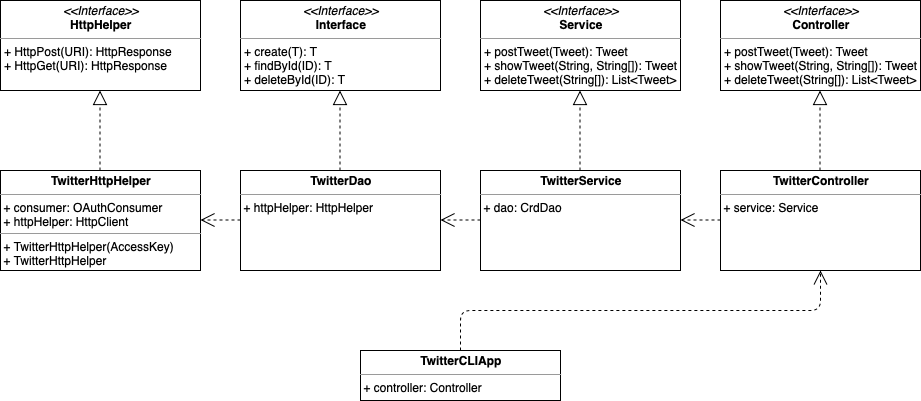

# Introduction
The TwitterCLI application is an MVC (minus V) based application that helps users create,  find a tweet, and delete tweets by ids via Twitter Rest API. Building this application helped me to be familiar with MVC architecture, REST API, integration testing, and Unit testing with Mockito framework. During the implementation, I deeply understand the dependency between each layer and the usage of DAO. I also learn the basics of Spring which helps me to develop more complicated applications in the future.

# Design Pattern
## UML Diagram
The UML class diagram of TwitterCLI application is shown below:



## Description of Components
- `TwitterHttpHelper`: This implementation is used to build connection between our Java Application and Twitter server. It will send and receive HTTP POST/GET requests and make corresponding responses.
- `TwitterDao`: This implementation is used to convert the input passed by Service into URI format and then passes the generated URIs to TwitterHttpHelper for executing the HTTP request and parses the HTTP response.
- `TwitterService`: This implementation is responsible for handling the business logic of the TwitterCLIApp and invoke methods defined in TwitterDao if the validation is successful.
- `TwitterController`: This implementation is used to parse the command arguments and invoke Service's functions to complete the tasks.  
- `TwitterCLIapp`: The most top layer of the application. It initializes all the components of the TwitterCLI application and pass the command to Controller.
 
# Quick Start
## Environment variables
* Set up the environment variables with OAuth 1.0 authentication keys and secrets by using `export`. Find the values of consumer key, consumer secret, access token, and token secret from Twitter Developer account and add them to the following command respectively.
``` bash
export consumerKey=*****
export consumerSecret=*****
export accessToken=*****
export tokenSecret=*****
``` 

## MVN
* To build the package, proceed to `twitter` directory and run the following command in terminal.
``` bash
mvn package
```
* To run this app, continue to run the following command.
```bash
java -jar target/java_apps-1.0-SNAPSHOT.jar post|show|delete [option(s)]
```

## Usage
#### Post a tweet
- Usage: `java -jar target/java_apps-1.0-SNAPSHOT.jar post "Text" "Longitude:Latitude"`  
 `"Text"`: The text user want to post.  
 `"Longitude:Latitude"`: User's current location. 
#### Find a tweet by its id
- Usage: `java -jar target/java_apps-1.0-SNAPSHOT.jar show "ID" "Fields"`  
`"ID"`: The Id of the tweet that users want to show.  
`"Fields"`: Fields indicated which part to show in the result.
#### Delete tweets by ids
- Usage: `java -jar target/java_apps-1.0-SNAPSHOT.jar delete "IDs" "options"`  
`"IDs`: List of ID corresponding to the tweets users want to delete.

# Model
The Model of TwitterCLI application contains five objects: `Tweet`, `Coordines`, `Entities`, `Hashtag`, and `UserMention`. The `Tweet` model is used to store the HTTP response in ```Json``` format from the Twitter server and the properties are parsed to `Tweet` object using JsonParser in `dao` package. An sample Json with interested properties used in the application is shown below.
```Json
{ 
  "created_at":"Mon Feb 18 21:24:39  0000 2019", 
  "id":1097607853932564480, 
  "id_str":"1097607853932564480", 
  "text":"test with loc223", 
  "entities":{ 
    "hashtags":[], 
    "user_mentions":[] 
  }, 
  "coordinates":null, 
  "retweet_count":0, 
  "favorite_count":0, 
  "favorited":false, 
  "retweeted":false 
}
```

# Future Improvements
1. Add more functions that can post images and videos.
2. Add functions to update tweets.
3. Make a GUI and use it conveniently