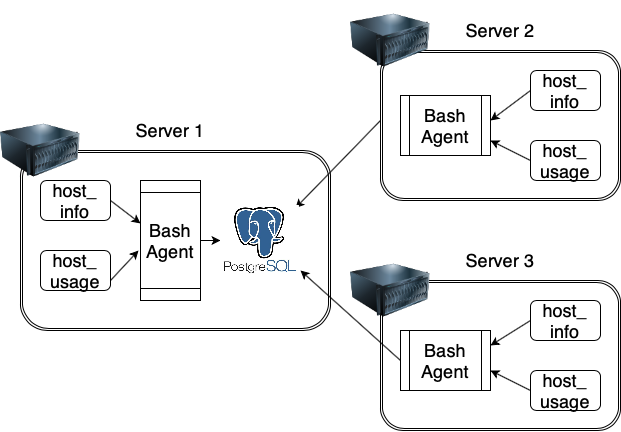

# Linux Cluster Monitoring Agent

##Introduction
This cluster monitoring agent is used to record the hardware specifications of each node and
 monitor node resource usage in real-time. The collected data can be used to generate report
s by the infrastructure team which helps them to make better resource planning in the future
.

## Architecture & Design



1. There are two tables in the database `host_agent`:
  * `host_info`: a table contains hardware specifications data of each node and there is only one host information for now.

###Schema of host_info
| Attributes       | Data Type    | Description                            |
| ---------------- | ------------ | -------------------------------------- |
| id               | SERIAL       | Primary key                            |
| hostname         | VARCHAR      | Unique                                 |
| cpu_number       | INT          | Number of cpu cores                    |
| cpu_architecture | VARCHAR      | x86_64                                 |
| cpu_model        | VARCHAR      | Intel(R) Xeon(R) CPU @ 2.30GHz         |
| cpu_mhz          | FLOAT8       | 2300                                   |
| l2_cache         | INT          | L2 cache in KB                         |
| total_mem        | INT          | Total memory in KB                     |
| "timestamp"      | TIMESTAMP    | Time when inserting data(UTC time zone)|

  * `host_usage`: a table contains server CPU and memory usage data.

###Schema of host_usage
| Attributes       | Data Type    | Description                            |
| ---------------- | ------------ | -------------------------------------- |
| "timestamp"      | TIMESTAMP    | Time when inserting data(UTC time zone)|
| host_id          | SERIAL       | References public.host_info(id)        |
| memory_free      | INT          | Free memory in KB                      |
| cpu_idel         | INT          | Percentage of idle cpu                 |
| cpu_kernel       | INT          | Percentage of kernel in tasks          |
| disk_io          | INT          | Number of inprogress IO                |
| disk_available   | INT          | Root directory available disk in KB    |

2. Scripts:
  * `psql_docker.sh`: a bash script is used to setup PostgreSQL with Docker and provision a
psql instance.
  * `host_info.sh`: a bash script is used to collect hardware specifications data and store
them in table host_info.
  * `host_usage.sh`: a bash script is used to collect server usage data and store them in ta
ble host_usage.
  * `ddl.sql`: a set of SQL queries to create database and tables that store the collected d
ata.
  * `queries.sql': a set of queries to find a group of hosts by hardware info and also calcu
late the average memory usage percentage for each host.

## Usage
1. Install PostgreSQL and create the database host_agent:
```
bash ./psql_docker.sh [start|stop] docker
psql -h localhost -U postgres -W -f ./ddl.sql
```

2. host_info.sh usage:
```
bash ./host_info.sh localhost 5432 host_agent postgres docker
```

3. host_usage.sh usage:
```
bash ./host_usage.sh localhost 5432 host_agent postgres docker
```

4. Crontab setup:
```
* * * * * bash /home/centos/dev/jarvis_data_eng_Hongting/linux_sql/scripts/host_usage.sh localhost 5432 host_agent postgres docker > /tmp/host_usage.log
```

## Improvements
1. Create a script which includes all commands for all processes, like docker initialization
,database&tables creation, and data insertion.
2. Allows more servers to add data into database instead of localhost.
3. Add queries to obtain more information and source usage about localhost.
